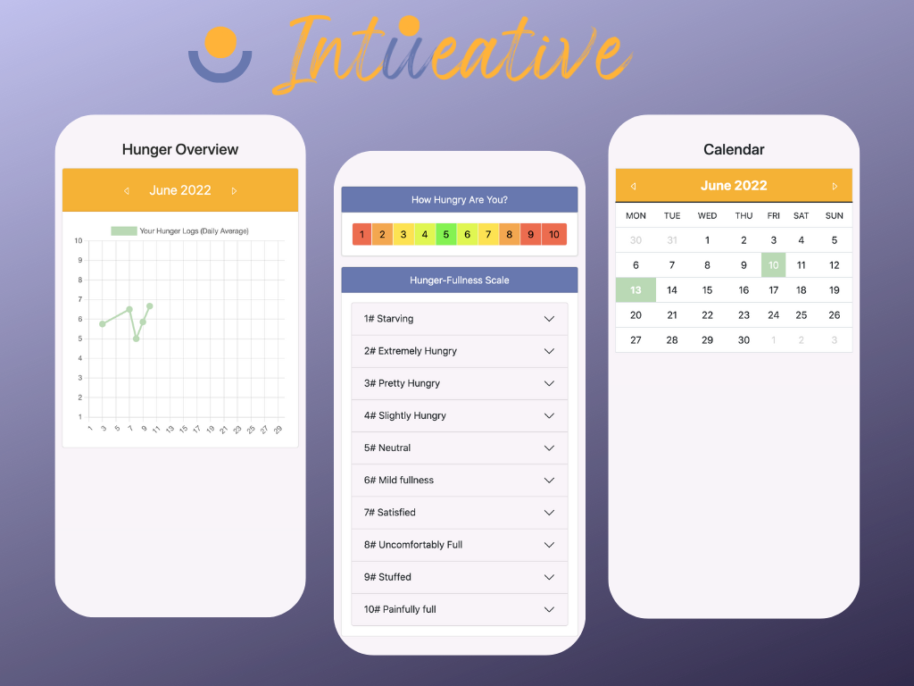

 

**IntUeative** is an app to check in with your hunger.
It can help you get into the habit of pausing and checking in with your body signals and identifying your hunger levels 

By checking in with your hunger regularly you can track your tendencies and patterns (i.e. often very hungry). Eventually, it can help you become more aware of when you to eat and when it's time to stop.

Highlighted Features:

* Calendar (created from scratch) 
* Evolution chart (using ChartJS)
* Backend simulation (localStorage) 
* Navigation with routes 
* Reminders' setting (Push notification simulation)
* Styled with Bootstrap 

